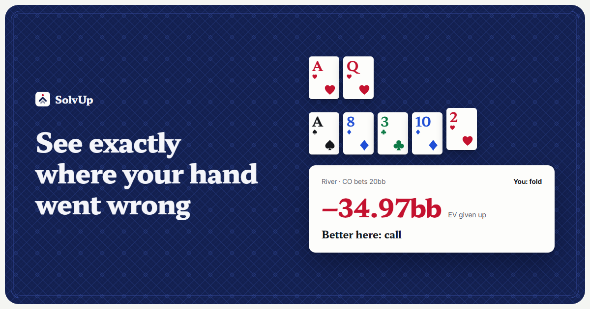
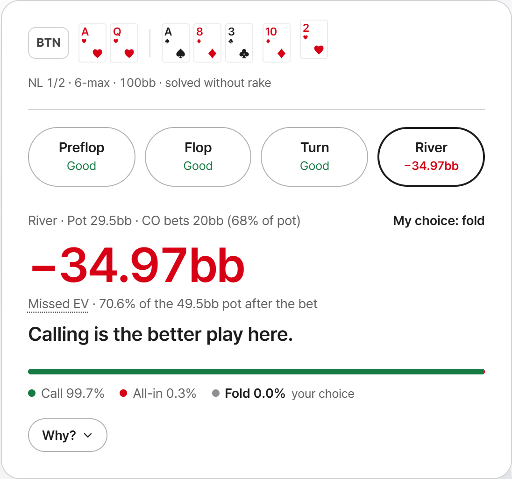
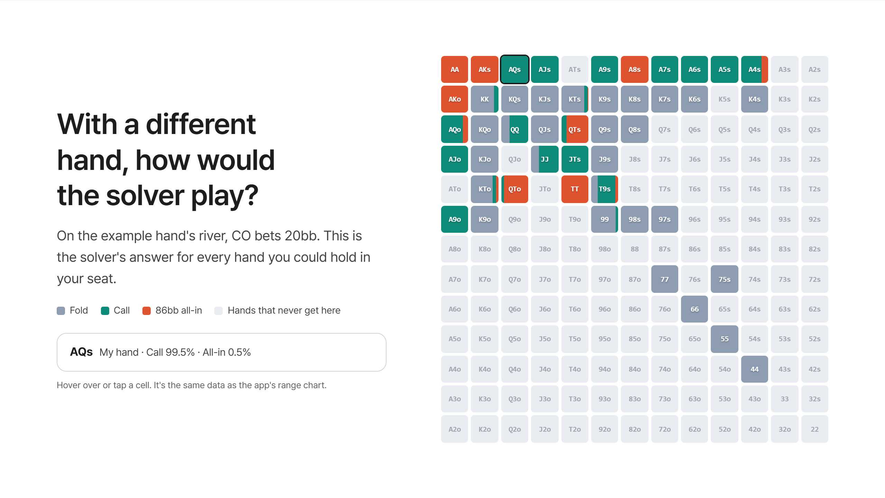
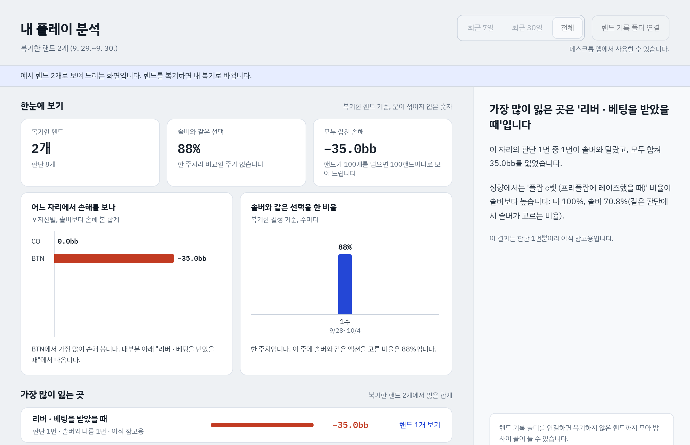
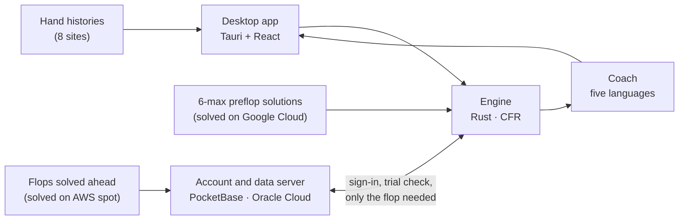

# SolvUp

> Paste a hand history and get the solver's answer and the EV you missed at every decision, explained in plain language.

[한국어](README.md) · **English**

This repository introduces SolvUp and publishes the **engine source** ([`engine/`](engine)) for transparency. The desktop app, the coach, the server and the precomputed data are private.

---

## The problem

Solvers are the reference for studying poker, but they are hard to start with.

- **You have to build the spot yourself.** Board, both ranges, stacks, bet sizes and rake all go in by hand before one hand can be solved.
- **The answer is hard to read.** You get frequency tables over thousands of combos and have to work out on your own how wrong your play was.
- **AI coaches do not calculate.** Plenty of tools explain hands in words, but none of that is the hand actually solved.

## What SolvUp does

Paste a hand history from a poker site; the app does the rest.

1. **Reads the record.** Pot, stacks, the bet sizes really played and the rake, as they were.
2. **Sets the ranges.** It starts from a 6-max preflop solution solved ahead of time and narrows the ranges along the real action with the solver's strategy.
3. **Solves street by street.** Flop, turn and river are solved on your PC under the hand's own conditions. Common flops come solved ahead of time from the server and are read at once.
4. **Compares every decision.** From preflop to the river: was your choice the solver's ("Good"), or how much EV did it miss?
5. **Explains in plain language.** Why, in five languages, with where every number in the explanation came from.

## Screens

**The solver's answer and the missed EV at every decision**

**Had you held another hand, what would the solver have done?** (the same spot, the solver's answer for every hand)

**As reviews add up, the leaks show** (EV lost by position and situation, how often you chose what the solver chooses; shown in Korean)

## Features

| | |
|---|---|
| **Input** | Reads PokerStars · GGPoker · ACR · CoinPoker · Winamax · 888poker · PartyPoker (beta) · iPoker (beta) histories; enter a hand by hand when there is no record; queue many hands and review them in turn |
| **Calculation** | 6-max preflop solutions with rake (100bb · 50bb); from the flop on, the hand solved as it was on your PC; heads-up and three-way pots; limped pots read at once from flops solved ahead |
| **Results** | "Good" or the missed EV at each decision, the solver's frequencies, the opponent's range and your equity in it, the solver's answer for every hand (range grid), and what the calculation could not model (antes and the like) said separately |
| **Study** | My play: EV lost by position and situation; VPIP · PFR · 3-bet · c-bet against the solver; the weekly share of decisions that matched the solver |
| **Advanced** | Bet and raise sizes and caps, sizes by position, no donk bets, ranges set by hand |
| **Languages** | 한국어 · English · 日本語 · 简体中文 · 繁體中文 |

## How it works

- **The solving runs on your PC.** The server checks the account and hands out data solved ahead of time, so reviews cost no server time and are not counted.
- **Flops solved ahead do not ship with the app.** Every one of the 1,755 flop classes of a line sits on the server, and a review fetches only its own flop. The app stays small.

## Engine

A CFR engine written from scratch; no other solver's code is used. The source is in [`engine/`](engine).

- **Algorithm:** Discounted CFR, parallel action nodes, suit isomorphism, solving within the memory the PC has free
- **Heads-up and three-way:** heads-up subgames and three-way pots (side pots included)
- **6-max preflop:** solutions by rake and stack, settled at a fixed point with postflop realization
- **Precision targets:** solved until the remaining exploitability is under 0.5% of the pot on the flop, 0.1% on the turn and river
- **Checks:** new algorithms are verified on Kuhn poker (two- and three-player) first; numeric code is tested against a slow, obviously correct reference implementation

## Numbers

| | |
|---|---|
| Code | Rust ~46,000 lines · TypeScript ~16,500 · server JS ~6,600 |
| Tests | engine 285 · app 240 · coach 58 |
| Flops solved ahead | limped pots: 2 lines × 1,755 done; raised pots: 16 lines × 1,755 being solved (October 2026) |
| Review time (8-core PC, flop solved ahead) | about 1 s when the hand ends on the flop; 3-35 s through the turn and river |

## Stack

| Area | Technology |
|---|---|
| Engine | Rust 2024 (own CFR), rayon |
| App | Tauri 2, React, TypeScript, Vite |
| Server | PocketBase (JS hooks), Caddy, Oracle Cloud |
| Large runs | AWS EC2 Spot (resumes after interruptions), Google Cloud |
| Website | Static HTML in five languages |

## Status and roadmap

- **Now:** the Windows desktop app is getting ready for launch. Sign up for the launch news at [solvup.app](https://solvup.app).
- **Planned updates:** Mac (Apple silicon), tournaments (ICM for short stacks), a linked hand-history folder, raised pots solved ahead, faster three-way pots, a phone app

## Contact

- Web: [solvup.app](https://solvup.app)
- Mail: contact@solvup.app

---

© 2026 SolvUp. All rights reserved. The engine source and the text and images here are published to be read only; no right to use, copy or distribute them is granted. See [LICENSE](LICENSE).
