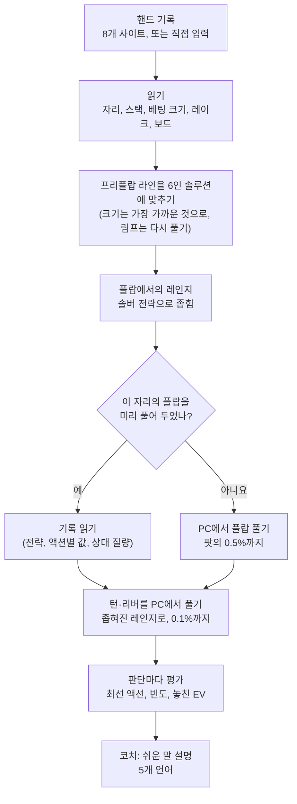
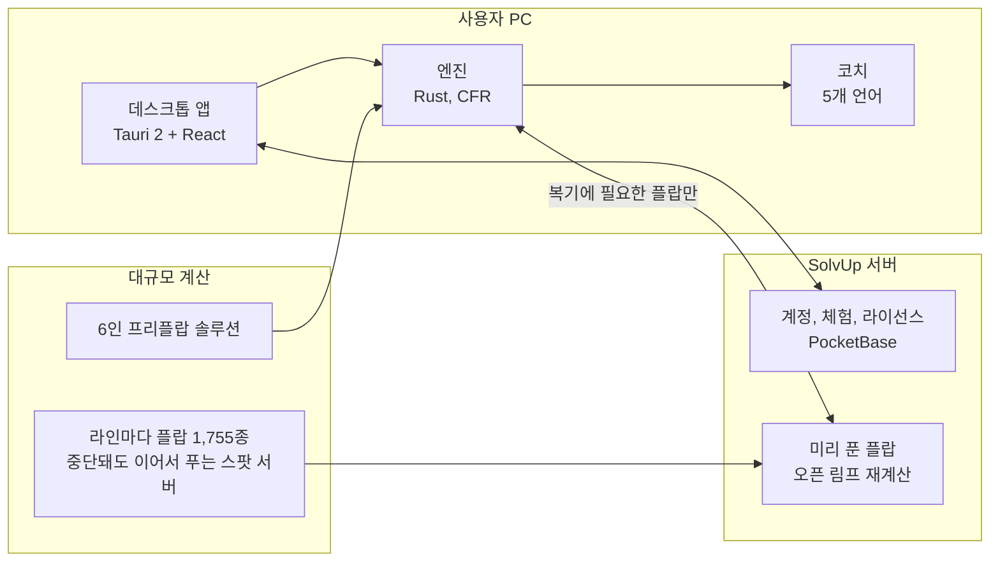

#  SolvUp

> 실제로 플레이한 핸드를 그대로 다시 세우고, 직접 만든 CFR 솔버로 스트리트마다 풀어, 판단 하나하나를 솔버의 답과 비교하는 노리밋 홀덤 복기 엔진

[English](README.md) · **한국어**

[](https://solvup.app)


SolvUp은 캐시게임 핸드를 복기하는 데스크톱 앱입니다. 이 저장소는 SolvUp을 소개하고, **엔진 소스**를 [`engine/`](engine)에 투명성 목적으로 공개합니다. 데스크톱 앱, 설명 코치, 계정 서버, 미리 계산한 데이터는 들어 있지 않습니다.

---

## 왜 솔버를 또 만들었나

솔버는 사용자가 만들어 준 상황에 답합니다. 보드, 두 사람의 레인지, 스택, 베팅 크기 목록을 넣어야 합니다. 그런데 내가 친 핸드를 복기하는 일은 다릅니다. 상황을 실제로 일어난 그대로 다시 세워야 합니다. 여섯 자리를 다 담은 프리플랍 전략에서 출발해, 실제로 나온 베팅 크기와 실제로 떼 간 레이크까지 맞춰야 합니다. 그리고 하룻저녁에 한 핸드가 아니라 한 세션을 복기할 수 있을 만큼 빨라야 합니다.

SolvUp의 엔진은 이 일에 맞춰 만들었습니다. 핸드 기록을 읽고, 실제로 흘러간 라인을 따라 각자의 레인지를 구하고, 스트리트마다 그 핸드의 조건 그대로 정해진 정밀도까지 풉니다. 그리고 판단마다 솔버라면 어떻게 치는지, 내 선택이 EV를 얼마나 놓쳤는지 알려 줍니다. 근사가 들어간 곳은 그렇다고 함께 적습니다.

## 핸드 하나를 복기하는 과정



1. **읽기.** PokerStars, GGPoker, ACR, CoinPoker, Winamax, 888poker, PartyPoker, iPoker 기록을 하나의 모델로 읽습니다. 자리와 포지션, 넣은 칩 하나하나, 돌려받은 벳, 레이크와 상한, 여러 번 깐 보드까지 읽습니다. 읽지 못한 핸드는 조용히 버리지 않고 알려 줍니다.
2. **프리플랍.** 라인을 미리 풀어 둔 6인 프리플랍 솔루션에 맞춥니다. 솔루션 트리에 없는 레이즈 크기는 가장 가까운 크기로 판정합니다. 솔루션이 하지 않는 상대의 오픈 림프가 나오면, 림프를 가정한 레인지로 고정하고 프리플랍을 다시 풉니다.
3. **레인지.** 각자는 정해진 차트가 아니라, 그 라인을 따라 솔루션 전략이 남긴 레인지로 플랍에 들어갑니다.
4. **포스트플랍.** 스트리트마다 그 핸드의 팟, 스택, 레이크, 실제로 나온 베팅 크기에 표준 크기를 더해 서브게임을 만듭니다. 자주 나오는 플랍은 미리 풀어 둔 저장소에서 읽고, 나머지는 사용자 PC에서 풉니다.
5. **판정.** 최선 액션과의 EV 차이가 계산 오차보다 클 때만 실수로 칩니다. 솔버도 섞는 선택은 실수로 치지 않습니다.

## 엔진이 다른 점

### 처음부터 직접 만든 CFR 엔진

- **Discounted CFR**, 노드 고정(locking), 무늬 대칭(isomorphism) 처리. 투톤 플랍에서는 턴 카드 49장이 서로 다른 36장으로, 모노톤 플랍에서는 23장으로 줄어듭니다.
- **액션 노드 병렬화**(rayon): 3인 회귀 테스트가 472초에서 166초로 줄었습니다.
- **메모리 보호.** 트리를 만들기 전에 크기를 미리 계산합니다. PC의 남은 메모리에 들어가지 않으면 PC를 멈추게 하는 대신 마지막 스트리트를 카드를 모두 깔아 정리합니다.
- **빠른 구현 옆에 참조 구현.** 카드 제거 합산, 정렬 쇼다운, 3인 쇼다운마다 느리지만 명백한 O(n²)/O(n³) 버전을 두고, 빠른 버전이 그와 같은지 테스트로 묶어 둡니다.
- **새 알고리즘은 장난감 게임에서 먼저 증명합니다.** 정답이 알려진 2인·3인 Kuhn 포커입니다.

### 프리플랍: 플랍 이후를 아는 6인 솔루션

프리플랍 게임은 여섯 자리, 액션 노드 17,418개입니다. 플랍을 올인 에퀴티만으로 정산하면 포스트플랍을 잘 못 치는 패를 과대평가합니다. 그래서 각 라인이 닿는 플랍들을 포스트플랍까지 풀어 **실현율(realization)**을 뽑고, 그것으로 정산을 고쳐 가며 고정점까지 반복했습니다(잔차 핸드당 0.054bb). 솔루션은 100bb와 50bb, 레이크 없음과 5%(상한 3bb)로 나뉘고, 클라우드에서 계산했습니다.

### 포스트플랍: 그 핸드의 트리를, 밝힌 정밀도까지

플랍은 익스플로잇이 **팟의 0.5%**, 턴과 리버는 **0.1%** 아래가 될 때까지 풉니다. 트리에는 실제로 나온 크기가 들어갑니다. 19.5bb 베팅은 19.5bb 베팅으로 판정합니다. 턴과 리버에는 따로 크기 세 개짜리 메뉴를 줘서, 한 가지 크기를 "정답 크기"로 오해하지 않게 합니다. 스트리트마다 반복 수, 익스플로잇, 메모리를 답과 함께 보여 줍니다.

### 3인 팟

세 명이 본 팟은 사이드 팟까지 별도의 3인 엔진이 맡습니다. 쌍 합 쇼다운, 팟 층, 그리고 한 명이 폴드하면 헤즈업 게임으로 바꾸는 단축 경로를 갖췄습니다. 3인 플랍은 팟의 1%까지 풀고, 리버는 나올 수 있는 카드를 모두 깔아 정산합니다.

### 미리 풀어 둔 플랍, 그리고 빌려 쓸 수 있는 조건

가장 흔한 프리플랍 라인은 **플랍 1,755종 전부**를 클라우드에서 미리 풀어 서버에 둡니다. 기록에는 플랍의 액션 노드만 담습니다. 평균 전략(16비트), 액션별 최선 대응 값, 패마다의 상대 질량입니다. 플랍 하나에 약 270 KB이고, 복기할 때는 그 핸드의 플랍 하나만 받습니다.

기록은 같은 게임이거나, 측정한 오차 안에서 충분히 가까울 때만 씁니다.

| 허용하는 차이 | 한도 | 판정이 바뀌는 비율 (측정) |
|---|---|---|
| 유효 스택 | 25% 안 | 0.2~1.0% |
| 같은 레이크율의 상한 차이 | 제한 없음 | 0.6~0.9% |
| 시작 레인지 (다른 자리의 오픈 림프 등) | 총변동거리 3% 이하 | 0.2~1.3% |
| 같은 라인의 오픈·레이즈 크기 (값은 팟에 맞춰 환산) | 팟 비율 1.25 이하 | 1.1~4.0% |

그 밖의 경우는 실제 그대로 풉니다. 플랍에서 올인이 나오면 항상 직접 풉니다. 빌려 온 기록은 올인을 다른 스택으로 계산하기 때문입니다.

### 오픈 림프

6인 솔루션에는 스몰 블라인드 외의 오픈 림프가 없습니다. 상대가 림프하면 림프가 있는 트리에서 프리플랍을 다시 풉니다. 림퍼는 가정한 레인지로 고정하고, 필요한 부분만 푸는 방식으로 45~80초가 걸립니다. 결과는 자리와 솔루션으로만 정해지므로, 솔루션 파일 내용의 해시를 이름으로 삼아 저장합니다(약 13 MB). 흔한 자리는 미리 계산해 서버에서 내려 주므로, 오픈 림프 복기도 1초 안에 시작합니다.

### 반영하지 못한 것은 숨기지 않는다

앤티, 사이트가 팟에 넣은 돈, 솔루션과 다른 스몰 블라인드, 솔루션에 없는 레이크, 가장 가까운 크기로 읽은 기록, 비슷한 자리에서 빌려 온 레인지. 이런 것은 슬쩍 넣지 않고 복기 결과에 하나씩 적습니다.

## 측정

**공개 솔버와 대조** (WASM Postflop, 같은 스팟과 트리, 같은 PC, 16스레드, 양쪽 모두 Discounted CFR):

| | WASM Postflop | SolvUp 엔진 |
|---|---|---|
| EV, OOP / IP (팟 100) | 55.6 / 44.4 | 55.56 / 44.44 |
| OOP 루트: 체크 / 50% 벳 | 38.9% / 61.1% | 38.9% / 61.1% |
| 핸드 클래스별 EV (AA, KK, AKs …) | | 기준과 0.1 안 |
| 220회 반복까지 (팟의 0.10%) | 22.8초 | 17.4~20.6초 |

**복기 시간** (8코어 데스크톱 라이젠 7 7800X3D, 100bb, 레이크 5%):

| 2인 팟 | 시간 |
|---|---|
| 림프 팟, 미리 푼 플랍, 플랍에서 끝나는 핸드 | 약 1초 |
| 림프 팟, 리버까지 | 25~35초 |
| 싱글 레이즈 팟, 미리 푼 플랍 | 3~10초 |
| 싱글 레이즈 팟, PC에서 플랍까지 풀 때 | 2~8분 |
| 3벳 팟, PC에서 풀 때 | 30~55초 |

## 실제 출력

플랍을 미리 풀어 둔 싱글 레이즈 팟에서 엔진이 낸 결과입니다(BTN 2.5bb 오픈, BB가 K♥J♥로 콜).

```text
preflop: UTG Fold, HJ Fold, CO Fold, BTN Raise 2.5, SB Fold, BB Call
  preflop, pot 4.00bb with KJs: Fold +0.00bb (0%) | *Call +1.16bb (46%) | Raise 10 +1.15bb (54%) | All-in +0.30bb (0%)
      -> best Call, loss 0.00bb
flop AsKcQh: BB vs BTN, pot 5.50bb, stack 97.50bb
  from the flop store, solved ahead: 269 iterations, 0.49% of the pot; bets [0.33, 0.75]
  flop first, with KhJh: *Check +2.68bb (98%) | Bet 2 (33%) +2.65bb (1%) | Bet 4 (75%) +2.63bb (0%)
      -> best Check, loss 0.00bb
turn AsKcQh7d: BB vs BTN, pot 9.10bb, stack 95.70bb
  solved: 5596 action nodes, 43 MB, 450 iterations, 0.10% of the pot, 5.1s
  turn after Check, Bet 6 (66%), to call 6.00bb with KhJh: Fold +0.00bb (1%) | *Call +2.13bb (97%) | Bet 27 (179%) +0.31bb (2%)
      -> best Call, loss 0.00bb
```

`*`는 실제로 한 액션입니다. 액션마다 EV와, 솔버가 이 패로 그 액션을 고르는 비율이 붙어 있습니다.

## 구조



계산은 사용자 PC에서 합니다. 서버는 계정을 확인하고 미리 계산한 데이터를 내려 줄 뿐 직접 풀지 않습니다. 그래서 복기에 서버 비용이 들지 않고, 복기 횟수도 세지 않습니다.

## 저장소 구성

```text
engine/
  crates/core     CFR, 게임 트리, 레인지, 2인·3인 서브게임, 6인 프리플랍과 실현율, Kuhn 테스트 게임
  crates/hh       핸드 기록 읽기와 플레이어 통계
  crates/review   핸드 복기: 프리플랍 대응, 스트리트별 풀기, 판정, 플랍 저장소, 오픈 림프
  crates/cli      `solver` 명령 (review, presolve, sixmax, solve, 측정 도구)
```

빌드 방법은 [`engine/README.md`](engine/README.md)에 있습니다. 복기에는 프리플랍 솔루션이 필요한데, 이것은 공개하지 않습니다.

## 숫자로 보면

| | |
|---|---|
| 엔진 | Rust 약 46,000줄, 테스트 285개 (앱 240개, 코치 58개 별도) |
| 읽는 핸드 기록 사이트 | 8곳 |
| 설명 언어 | English, 한국어, 日本語, 简体中文, 繁體中文 |
| 미리 푼 플랍 | 림프 팟 2라인 × 1,755 완료, 레이즈 팟 16라인 × 1,755 계산 중 (2026년 10월) |

## 현황

Windows 앱 출시를 준비하고 있습니다. 소식은 [solvup.app](https://solvup.app)에서 받으실 수 있습니다. 출시 뒤 계획은 macOS(애플 실리콘), 토너먼트(짧은 스택은 ICM까지), 3인 팟 속도, 핸드 기록 폴더 연결, 휴대폰 앱입니다.

## 라이선스

© 2026 SolvUp. **All rights reserved.** 엔진 소스와 이 저장소의 내용은 읽기 위한 용도로만 공개하며, 사용·복제·수정·배포할 권리는 주지 않습니다. 자세한 내용은 [LICENSE](LICENSE)를 보세요. 문의: contact@solvup.app
