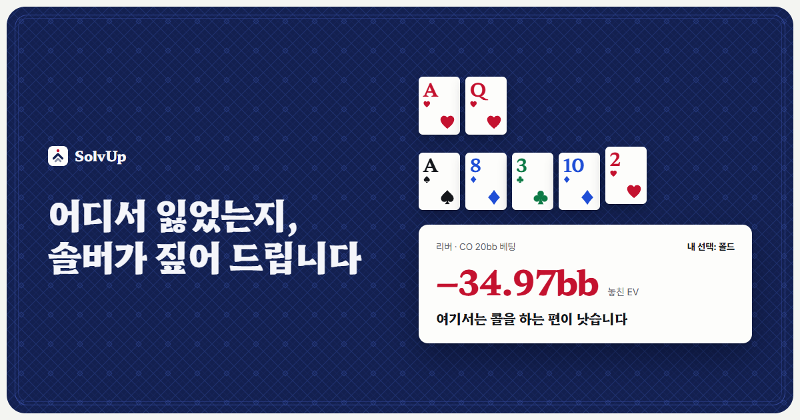
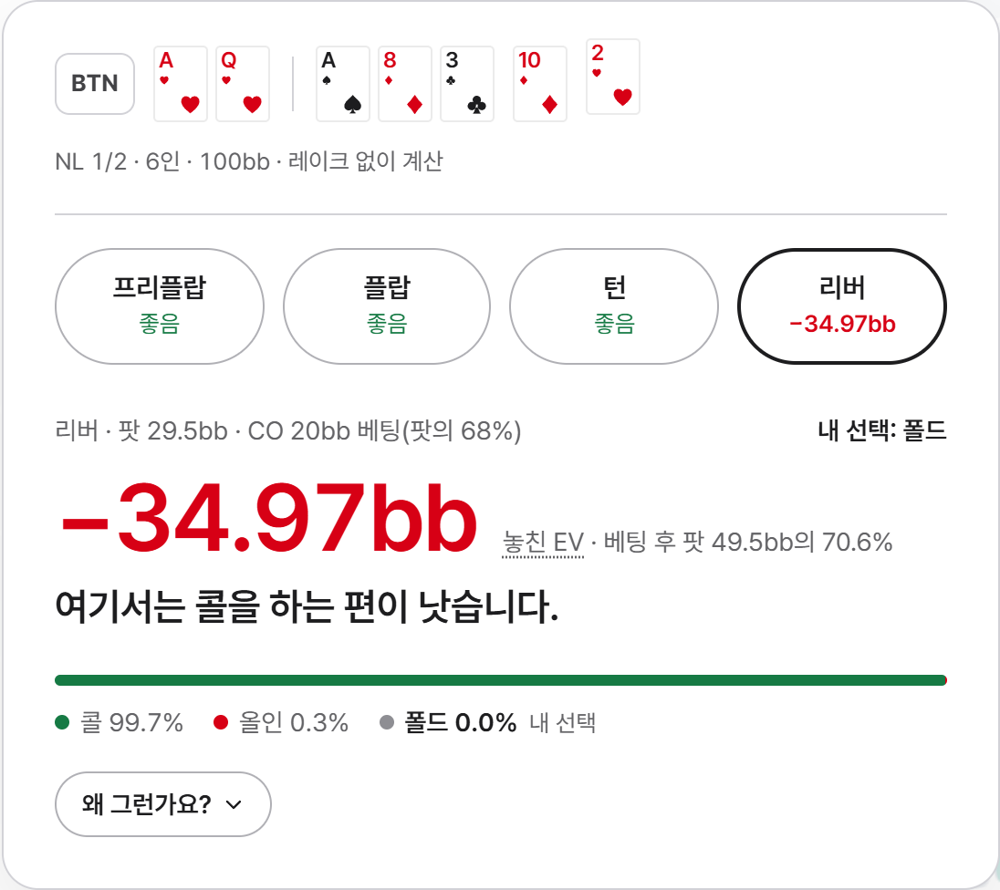
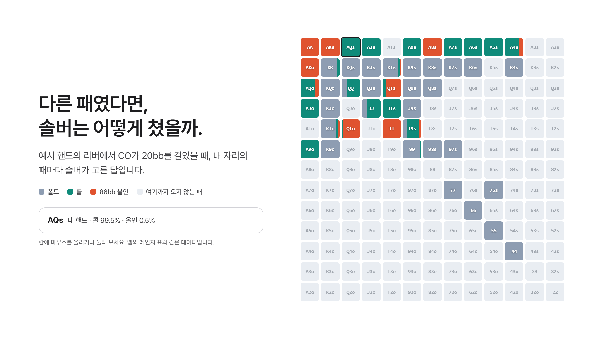
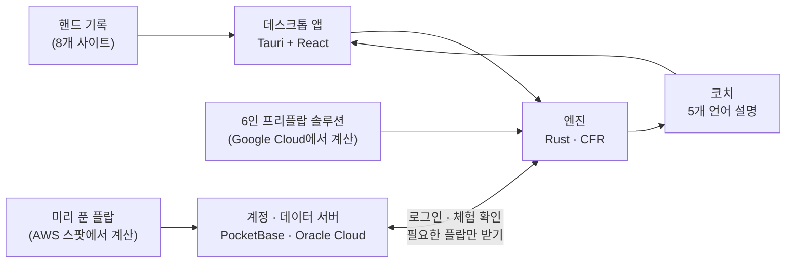

# SolvUp

> 핸드 기록을 붙여 넣으면, 판단마다 솔버의 답과 놓친 EV를 쉬운 말로 알려 주는 텍사스 홀덤 복기 앱

**한국어** · [English](README.en.md)

이 저장소는 SolvUp을 소개하고, **엔진 소스**([`engine/`](engine))를 투명성 목적으로 공개합니다. 데스크톱 앱, 설명 코치, 서버, 미리 푼 데이터는 비공개입니다.

---

## 문제

솔버는 포커 공부의 기준이지만, 처음 쓰는 사람에게는 문턱이 높습니다.

- **상황을 직접 만들어야 합니다.** 보드, 두 사람의 레인지, 스택, 베팅 크기, 레이크를 하나하나 넣어야 핸드 하나를 풀 수 있습니다.
- **답을 읽기 어렵습니다.** 수천 개 조합의 빈도표를 보고 "내 선택이 얼마나 틀렸는지"를 스스로 계산해야 합니다.
- **AI 코치는 계산하지 않습니다.** 말로 설명해 주는 도구는 많지만, 그 핸드를 실제로 풀어 본 답은 아닙니다.

## SolvUp이 하는 일

포커 사이트의 핸드 기록을 붙여 넣으면 나머지는 앱이 합니다.

1. **기록 읽기.** 팟, 스택, 실제 베팅 크기, 레이크를 그대로 읽습니다.
2. **레인지 정하기.** 미리 풀어 둔 6인 프리플랍 솔루션에서 시작해, 실제 액션을 따라 솔버 전략으로 레인지를 좁힙니다.
3. **스트리트마다 풀기.** 플랍·턴·리버를 그 핸드의 조건 그대로 내 PC에서 풉니다. 자주 나오는 플랍은 미리 풀어 둔 결과를 서버에서 받아 바로 읽습니다.
4. **판단마다 비교.** 프리플랍부터 리버까지, 내 선택이 솔버와 같은지("좋음") 아니면 EV를 얼마나 놓쳤는지 보여 줍니다.
5. **쉬운 말로 설명.** 왜 그런지를 5개 언어로 설명하고, 설명에 나온 숫자가 어디서 나왔는지도 함께 보여 줍니다.

## 화면

**판단마다 솔버의 답과 놓친 EV**

**다른 패였다면, 솔버는 어떻게 쳤을까** (같은 자리, 패마다 솔버가 고른 답)

**복기가 쌓이면 새는 곳이 보입니다** (자리별·상황별 EV 손실, 솔버와 같은 선택을 한 비율)

## 주요 기능

| 구분 | 내용 |
|---|---|
| **넣기** | PokerStars · GGPoker · ACR · CoinPoker · Winamax · 888poker · PartyPoker(베타) · iPoker(베타) 기록 읽기, 기록이 없으면 직접 입력, 여러 핸드를 걸어 두고 차례대로 복기 |
| **계산** | 레이크를 반영한 6인 프리플랍 솔루션(100bb · 50bb), 플랍부터는 그 핸드 그대로 PC에서 직접 풀기, 2인 팟과 3인 팟, 림프 팟은 미리 풀어 둔 플랍으로 즉시 |
| **결과** | 판단마다 "좋음" 또는 놓친 EV, 솔버가 고른 비율, 상대 레인지 구성과 내 패의 에퀴티, 패마다 솔버의 답(레인지 표), 반영하지 못한 부분(앤티 등)은 따로 표시 |
| **공부** | 내 플레이 분석(자리별·상황별 손실), VPIP · PFR · 3벳 · c벳 성향 비교, 주마다 솔버와 같은 선택을 한 비율 |
| **고급 설정** | 베팅·레이즈 크기와 횟수, 포지션별 크기, 동크 금지, 내·상대 레인지 직접 편집 |
| **언어** | 한국어 · English · 日本語 · 简体中文 · 繁體中文 |

## 동작 방식

- **계산은 내 PC에서 합니다.** 서버는 계정 확인과 미리 풀어 둔 데이터를 내려 주는 일만 해서, 복기 횟수에 서버 비용이 붙지 않습니다.
- **미리 풀어 둔 플랍은 앱에 넣지 않습니다.** 라인마다 플랍 1,755개 전부를 서버에 두고, 복기할 때 그 핸드의 플랍 하나만 받아 읽습니다. 앱 용량은 작게 유지됩니다.

## 엔진

직접 만든 CFR 엔진입니다. 다른 솔버의 코드를 쓰지 않았습니다. 소스는 [`engine/`](engine)에 있습니다.

- **알고리즘:** Discounted CFR, 액션 노드 병렬화, 무늬 대칭(isomorphism) 처리, 메모리 한도 안에서만 풀기
- **2인과 3인:** 헤즈업 서브게임과 3인 팟(사이드 팟 포함)을 모두 풉니다.
- **6인 프리플랍:** 레이크와 스택별 솔루션, 플랍 이후의 실현율(realization)을 반영한 고정점 계산
- **정밀도 목표:** 남은 오차가 팟의 0.5%(플랍), 0.1%(턴·리버) 아래가 될 때까지 풉니다.
- **검증:** 새 알고리즘은 Kuhn 포커(2인·3인)로 먼저 확인하고, 수치 코드는 느리지만 명백한 참조 구현과 대조하는 테스트를 같이 둡니다.

## 수치

| 항목 | 값 |
|---|---|
| 코드 | Rust 약 46,000줄 · TypeScript 약 16,500줄 · 서버 JS 약 6,600줄 |
| 테스트 | 엔진 285개 · 앱 240개 · 코치 58개 |
| 미리 푼 플랍 | 림프 팟 2라인 × 1,755개 완료, 레이즈 팟 16라인 × 1,755개 계산 중 (2026년 10월) |
| 복기 시간 (8코어 PC, 미리 푼 플랍이 있을 때) | 플랍에서 끝나는 핸드 약 1초, 턴·리버까지 3~35초 |

## 기술 스택

| 영역 | 사용 기술 |
|---|---|
| 엔진 | Rust 2024 (자체 CFR), rayon |
| 앱 | Tauri 2, React, TypeScript, Vite |
| 서버 | PocketBase (JS 훅), Caddy, Oracle Cloud |
| 대규모 계산 | AWS EC2 스팟 (중단돼도 이어서 푸는 방식), Google Cloud |
| 사이트 | 정적 HTML, 5개 언어 |

## 현황과 계획

- **지금:** Windows 데스크톱 앱 출시 준비 중입니다. [solvup.app](https://solvup.app)에서 출시 소식을 받으실 수 있습니다.
- **업데이트 예정:** Mac(애플 실리콘), 토너먼트(짧은 스택은 ICM까지), 핸드 기록 폴더 연결, 레이즈 팟 미리 풀기, 3인 팟 속도, 휴대폰 앱

## 문의

- 웹: [solvup.app](https://solvup.app)
- 메일: contact@solvup.app

---

© 2026 SolvUp. All rights reserved. 엔진 소스와 이 저장소의 글·이미지는 보기 위한 용도로만 공개하며, 사용·복제·배포 권리는 주지 않습니다. 자세한 내용은 [LICENSE](LICENSE)를 보세요.
