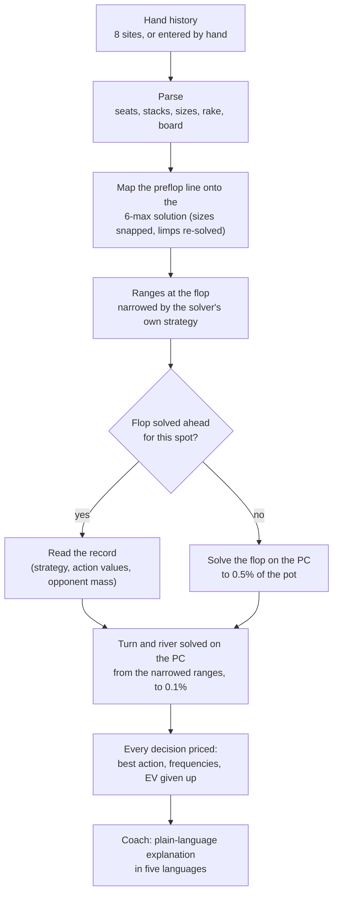
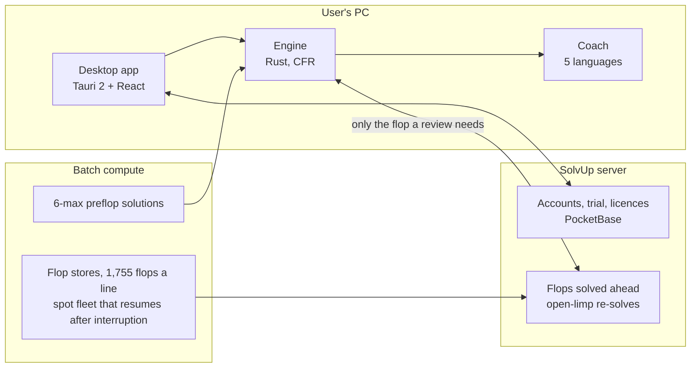

#  SolvUp

> A no-limit hold'em hand-review engine: it rebuilds the hand you actually played, solves it street by street with its own CFR solver, and prices every decision against the solver's answer.

**English** · [한국어](README.ko.md)

[](https://solvup.app)


SolvUp is a desktop app for reviewing cash-game hands. This repository introduces it and publishes the **engine source** in [`engine/`](engine) for transparency. The desktop app, the plain-language coach, the account server and the precomputed data are not part of it.

---

## Why another solver

A solver answers the spot you build for it: a board, two ranges, a stack, a list of bet sizes. Reviewing a hand you played is a different job. The spot has to be rebuilt exactly as it happened: from a preflop strategy that covers six seats, through the bet sizes really used, at the rake really taken. And it has to be fast enough to review a session, not one hand an evening.

SolvUp's engine is built around that job. It reads the hand history, derives each player's range along the line actually played, solves every street under the hand's own conditions to a stated precision, and reports, for each of your decisions, what the solver plays there and how much EV your choice gave up. Where the review had to approximate, it says so.

## How a hand is reviewed



1. **Parsing.** PokerStars, GGPoker, ACR, CoinPoker, Winamax, 888poker, PartyPoker and iPoker histories are read into one model: seats and positions, every chip put in, uncalled bets, rake and its cap, boards run more than once. Hands that cannot be read are reported, not dropped.
2. **Preflop.** The line is mapped onto a precomputed 6-max preflop solution. A raise size that is not on the solution's tree is judged at the nearest one. An opponent's open limp, which the solution never plays, triggers a re-solve of the preflop with the limp locked to an assumed range.
3. **Ranges.** Each player reaches the flop with the range the solution's strategy gives along that exact line, not a generic chart.
4. **Postflop.** Each street is a subgame built from the hand's pot, stacks, rake and the sizes actually bet, plus a standard menu. Common flops come from a store solved ahead of time; the rest is solved on the user's PC.
5. **Verdicts.** A decision is a mistake only when its EV falls short of the best action by more than the solve's own error. A mix the solver itself plays is never called a mistake.

## What sets the engine apart

### A CFR engine written from scratch

- **Discounted CFR** with node locking and suit isomorphism: on a two-tone flop the 49 turn cards reduce to 36 distinct ones, on a monotone flop to 23.
- **Parallel action nodes** (rayon): the three-way regression test went from 472 s to 166 s.
- **A memory guard.** The tree's size is estimated before it is built; a solve that would not fit the memory the PC has free deals out its last street instead of crashing the machine.
- **Reference implementations beside the fast ones.** Card-removal sums, sorted showdowns and three-way showdowns each have a slow, obviously correct O(n²)/O(n³) version, and tests hold the fast path to it.
- **New algorithms are proven on toy games first:** two- and three-player Kuhn poker, where the exact answers are known.

### Preflop: a 6-max solution that knows what follows the flop

The preflop game has six seats and 17,418 action nodes. Settling a flop by raw all-in equity overvalues hands that cannot play postflop, so the solution is settled with **realization factors** extracted from postflop solves of the flops each line reaches, iterated to a fixed point (residual 0.054 bb a hand). Solutions exist for 100bb and 50bb, with and without rake (5%, capped at 3bb), computed on cloud machines.

### Postflop: the hand's own tree, to a stated precision

The flop is solved until its exploitability is under **0.5% of the pot**, the turn and river under **0.1%**. The tree carries the sizes really bet, so a 19.5bb bet is judged as a 19.5bb bet, and the turn and river get a three-size menu of their own so that no single size is taken for *the* size. Each street reports its iterations, exploitability and memory beside the answer.

### Three-way pots

A separate three-player engine handles pots seen by three players, side pots included: pair-sum showdowns, pot layers, and a fold short-circuit that turns a dead seat into a heads-up game. The three-way flop is solved to 1% of the pot and its river settled by enumerating the runouts.

### Flops solved ahead, and when a record may stand in

For the most common preflop lines, all **1,755 flop classes** are solved ahead of time on cloud machines and kept on the server. A record holds only the flop's own action nodes: the average strategy as 16-bit shares, the best-response value of each action, and the opponent mass behind each hand. That is about 270 KB a flop, and a review downloads only the flop it was dealt.

A record answers a spot only when the spot is the same game, or close enough by a measured margin:

| Allowed difference | Limit | Verdicts that change (measured) |
|---|---|---|
| Effective stack | within 25% | 0.2-1.0% |
| Rake cap, same rate | any | 0.6-0.9% |
| Starting ranges (an open limp from another seat) | total variation ≤ 3% | 0.2-1.3% |
| Open or raise size on the same line, values scaled to the pot | pot ratio ≤ 1.25 | 1.1-4.0% |

Anything else is solved as played. A flop with an all-in in it is always solved, since a borrowed record would price the all-in at the wrong stack.

### Open limps

The 6-max solution plays no open limp outside the small blind. When an opponent limps, the preflop is re-solved on a tree with limps, the limper locked to an assumed range: a pruned solve of 45-80 s. The result depends only on the seat and the solution, so it is keyed by a hash of the solution file's contents and kept (about 13 MB). The common seats are computed ahead and served, so an open-limp review starts in a fraction of a second.

### Honest about what it could not model

Antes, money a site adds to the pot, a small blind that differs from the solution's, rake the solution did not include, a size read at the nearest record, a range borrowed from a nearby spot: each is listed with the review instead of being folded in silently.

## Measured

**Against an open-source reference** (WASM Postflop; same spot and tree, same PC, 16 threads, Discounted CFR on both sides):

| | WASM Postflop | SolvUp engine |
|---|---|---|
| EV, OOP / IP (pot 100) | 55.6 / 44.4 | 55.56 / 44.44 |
| OOP root: check / bet 50% | 38.9% / 61.1% | 38.9% / 61.1% |
| Hand-class EVs (AA, KK, AKs, ...) | | within 0.1 of the reference |
| Time to 220 iterations (0.10% of the pot) | 22.8 s | 17.4-20.6 s |

**Review time** on an 8-core desktop (Ryzen 7 7800X3D), 100bb, 5% rake:

| Heads-up pot | Time |
|---|---|
| Limped pot, flop solved ahead, hand ends on the flop | about 1 s |
| Limped pot, played to the river | 25-35 s |
| Single-raised pot, flop solved ahead | 3-10 s |
| Single-raised pot, flop solved on the PC | 2-8 min |
| 3-bet pot, solved on the PC | 30-55 s |

## Example

The engine's output for a single-raised pot whose flop was solved ahead (the button opens 2.5bb, the big blind calls with K♥J♥):

```text
preflop: UTG Fold, HJ Fold, CO Fold, BTN Raise 2.5, SB Fold, BB Call
  preflop, pot 4.00bb with KJs: Fold +0.00bb (0%) | *Call +1.16bb (46%) | Raise 10 +1.15bb (54%) | All-in +0.30bb (0%)
      -> best Call, loss 0.00bb
flop AsKcQh: BB vs BTN, pot 5.50bb, stack 97.50bb
  from the flop store, solved ahead: 269 iterations, 0.49% of the pot; bets [0.33, 0.75]
  flop first, with KhJh: *Check +2.68bb (98%) | Bet 2 (33%) +2.65bb (1%) | Bet 4 (75%) +2.63bb (0%)
      -> best Check, loss 0.00bb
turn AsKcQh7d: BB vs BTN, pot 9.10bb, stack 95.70bb
  solved: 5596 action nodes, 43 MB, 450 iterations, 0.10% of the pot, 5.1s
  turn after Check, Bet 6 (66%), to call 6.00bb with KhJh: Fold +0.00bb (1%) | *Call +2.13bb (97%) | Bet 27 (179%) +0.31bb (2%)
      -> best Call, loss 0.00bb
```

`*` marks the action taken. Each action shows its EV and how often the solver plays it with this hand.

## Architecture



The solving happens on the user's PC. The server checks the account and hands out data computed ahead of time; it never solves, so reviews cost nothing to serve and are not counted.

## Repository layout

```text
engine/
  crates/core     CFR, game trees, ranges, 2- and 3-player subgames, 6-max preflop and realization, Kuhn test games
  crates/hh       hand-history parsers and per-player statistics
  crates/review   reviewing a hand: preflop mapping, street solves, verdicts, flop store, open limps
  crates/cli      the `solver` command (review, presolve, sixmax, solve, measuring tools)
```

See [`engine/README.md`](engine/README.md) to build it. A review also needs a preflop solution, which is not published.

## In numbers

| | |
|---|---|
| Engine | about 46,000 lines of Rust, 285 tests (plus 240 in the app and 58 in the coach) |
| Hand-history sites | 8 |
| Languages | English, 한국어, 日本語, 简体中文, 繁體中文 |
| Flops solved ahead | limped pots: 2 lines × 1,755 done; raised pots: 16 lines × 1,755 in progress (October 2026) |

## Status

The Windows app is preparing for launch; see [solvup.app](https://solvup.app). Planned after launch: macOS (Apple silicon), tournaments (with ICM for short stacks), faster three-way pots, a linked hand-history folder, a phone companion.

## License

© 2026 SolvUp. **All rights reserved.** The engine source and the contents of this repository are published to be read only; no right to use, copy, modify or distribute them is granted. See [LICENSE](LICENSE). Contact: contact@solvup.app
